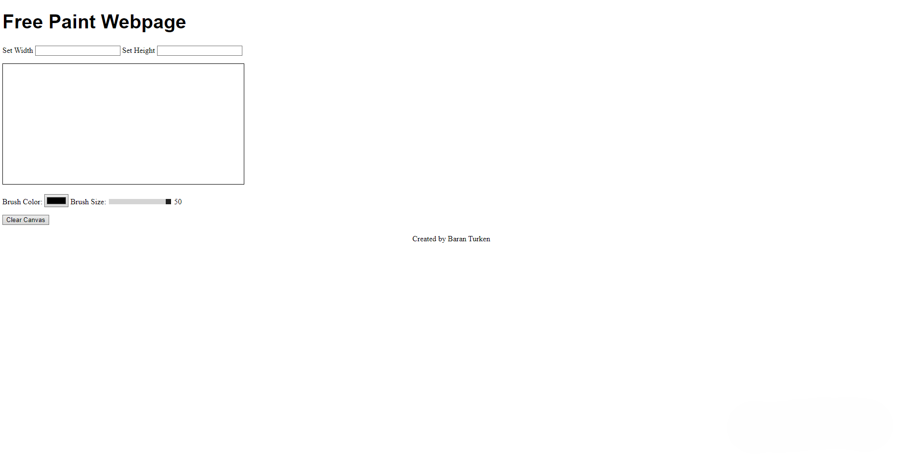
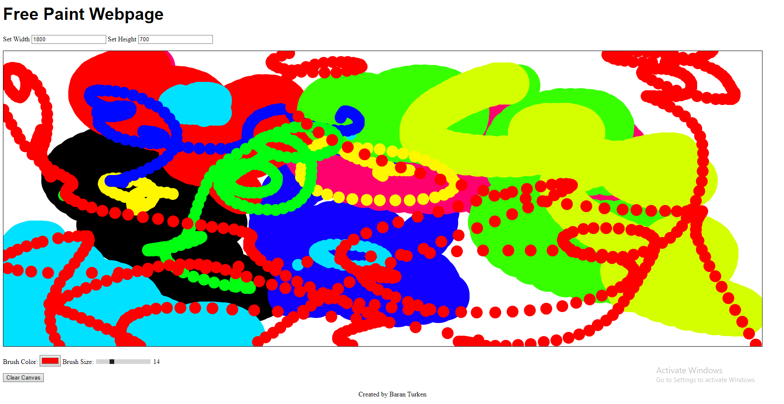

# Free Paint Webpage
This project is a simple, interactive painting application built using HTML5, CSS, and JavaScript. Users can set custom canvas dimensions, choose brush sizes and colors, and draw freely on the canvas. The project is hosted using GitHub Pages and can be accessed here.

## Features

Set custom canvas width and height.
Choose brush color using the color picker.
Adjust brush size with a slider.
Draw by clicking and moving the mouse on the canvas.
Clear the canvas at any time to start over.

## How to Use

1. Set the Canvas Dimensions:
Enter values for the width and height to adjust the size of the canvas.
2. Choose Brush Color:
Use the color picker to select a brush color.
3. Adjust Brush Size:
Use the range slider to set the size of your brush.
4. Draw on the Canvas:
Click and drag on the canvas to start drawing. Release the mouse button to stop drawing.
5. Clear the Canvas:
Press the "Clear Canvas" button to reset the canvas.

## Technologies Used

- HTML5: Structure of the webpage.
- CSS: Basic styling for the page and canvas.
- JavaScript: Handles the painting functionality, canvas resizing, and user interactions.

## Screenshots

Here are a few screenshots of the project:

- 
- 

## Project Structure

index.html: Main HTML structure of the page.
style.css: Basic styles for the page and canvas.
script.js: Contains the JavaScript code responsible for canvas drawing, resizing, color, and brush controls.

## How to Run Locally

To run this project locally on your machine:

1. Clone the repository:
git clone https://github.com/baranturken/free-paint-webpage.git
2. Open index.html in your browser.

## Author
** Baran Turken
Feel free to fork this project and contribute!
